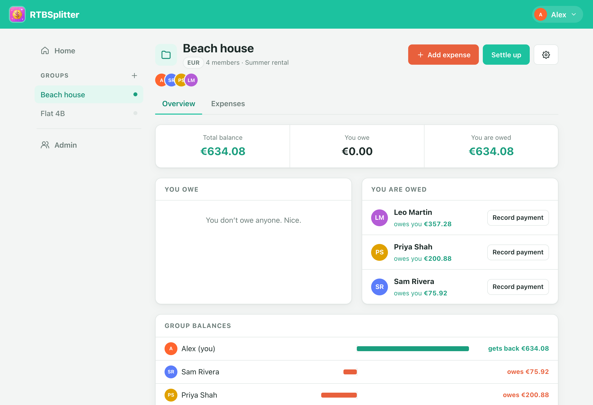
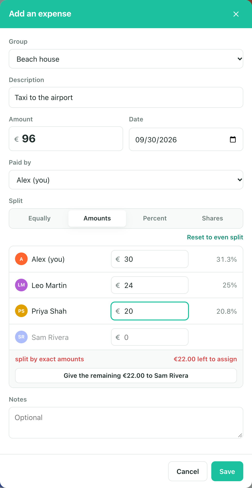
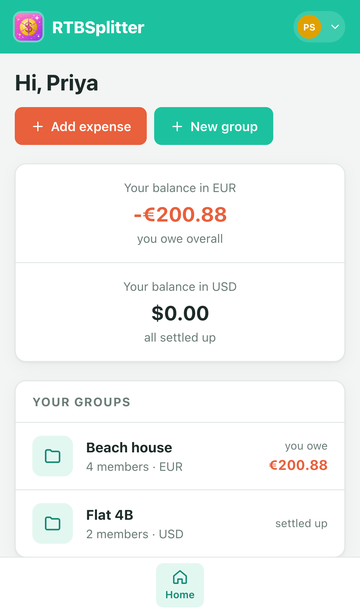

# RTBSplitter

**Split bills with your friends, without the ads.** RTBSplitter is a small, self-hosted bill-splitting app. You run your own copy for free on Cloudflare, and your group uses it from a browser or right inside Telegram.

<p align="center">
  
</p>

<p align="center">
  
  &nbsp;&nbsp;
  
</p>

## What it does

- **Groups:** as many as you like (a flat, a trip, a couple), each with its own members and currency. Archive them when settled, or delete them.
- **Expenses:** split equally, by exact amounts, by percentages or by shares. The form shows each person's share live, and one tap assigns whatever is left.
- **Simplified debts:** every group works out the fewest payments that settle everyone. Record a payment with **Settle up**.
- **Telegram:** people get a message when an expense or payment involving them is added, changed or deleted, with their new balance. The bot's **Open RTBSplitter** button opens the whole app inside Telegram, already signed in.
- **Accounts:** an admin adds people, and there's no public sign-up. New people can join from a Telegram invite link, with no password needed.
- **Any currency** per group (฿, €, £, ¥…), stored as whole cents so totals always add up exactly.
- **Works on phones** and in dark mode. No ads, no tracking, and no dependencies at runtime.

## Set it up

> **Using Claude Code?** Open this folder in Claude Code and say *"help me set this up"*. [`CLAUDE.md`](CLAUDE.md) walks it through the steps below and tells it which ones you need to do yourself.

There are three ways to run it:

| | Best for | Cost | HTTPS |
| --- | --- | --- | --- |
| **[A. Cloudflare](#a-cloudflare-recommended)** (recommended) | Real use by a group | Free | Automatic |
| **[B. Your computer](#b-on-your-computer)** | Trying it out, development | Free | No |
| **[C. Your own Ubuntu server](#c-on-your-own-ubuntu-server)** | People who already run a server | Server cost | With a domain |

**You'll need** [Node.js 22.13 or newer](https://nodejs.org), `git`, and for option A a free [Cloudflare account](https://dash.cloudflare.com/sign-up).

### A. Cloudflare (recommended)

Takes about 10 minutes. Run every command in a normal terminal, inside the project folder.

1. **Get the code**
   ```sh
   git clone https://github.com/mesjj/rtbsplitter.git
   cd rtbsplitter
   npm install
   ```

2. **Log in to Cloudflare.** This opens your browser; click **Allow**.
   ```sh
   npx wrangler login
   ```

3. **Create the database**
   ```sh
   npx wrangler d1 create rtbsplitter
   ```
   It prints a `database_id`. Keep it for the next step.

4. **Point the project at *your* database.** Open `wrangler.jsonc` and change three values:
   ```jsonc
   "name": "rtbsplitter",                  // your app's name, which becomes part of its web address
   ...
   "database_name": "rtbsplitter",
   "database_id": "paste-the-id-from-step-3"
   ```
   The values already in the file belong to the original author's copy. Replace them.

5. **Create the tables**
   ```sh
   npx wrangler d1 execute rtbsplitter --remote --file lib/schema.sql
   ```

6. **Deploy**
   ```sh
   npm test && npx wrangler deploy
   ```
   On a brand-new Cloudflare account it asks you to pick a **workers.dev subdomain**; any name is fine. At the end it prints your app's address, like `https://rtbsplitter.<your-subdomain>.workers.dev`.

7. **Choose the first admin's password**
   ```sh
   npx wrangler secret put ADMIN_PASSWORD
   ```
   Type a password when it asks. The first time the app is visited, it creates an account called `admin` with that password.

8. **Open the address from step 6** and log in as `admin`. The first visit to a new workers.dev address can fail for a minute or two while Cloudflare issues its HTTPS certificate. Then:
   - Change your password: your name (top right) → **Change password**.
   - Set your display name: your name (top right) → **Change display name**.
   - Add everyone: **Admin → Add person**.

That's it. Optionally, set up Telegram next.

### Telegram (optional)

1. In Telegram, message **[@BotFather](https://t.me/BotFather)**, send `/newbot`, and follow the prompts. It gives you a **token** like `123456789:AA…`. Treat it like a password.
2. Store the token in Cloudflare. **Run this in your own terminal**, then paste the token when it asks:
   ```sh
   npx wrangler secret put TELEGRAM_BOT_TOKEN
   ```
   Or use the Cloudflare dashboard: **Workers & Pages → your app → Settings → Variables and Secrets → Add**, with **Type: Secret**. Don't pick the default *Text*, because deploys remove plain-text variables.
3. In the app, go to **Admin → Telegram notifications → Connect bot to this site**. This also adds the **Open RTBSplitter** button to the bot and sets its name. You can press **Set bot picture to the app icon** too.
4. Get people connected, in either of two ways:
   - **Existing users:** your name (top right) → **Telegram notifications** → **Open Telegram to connect**, then tap **Start**.
   - **New people:** on **Admin**, add the person (the password can be left blank), then send them their **Telegram invite** link. They tap **Start**, and they're in. Admins on Telegram get a message when someone joins.

### B. On your computer

```sh
git clone https://github.com/mesjj/rtbsplitter.git
cd rtbsplitter
npm start
```

Open http://localhost:3000. The first start creates an `admin` account and prints its password in the terminal; to choose it yourself, use `ADMIN_PASSWORD=something npm start`. Data is kept in `data/rtbsplitter.db`.

For Telegram when running locally, start it with `TELEGRAM_BOT_TOKEN=… npm start`. Telegram can only reach a public HTTPS address, though, so the bot's replies and the Open button only work when deployed.

### C. On your own Ubuntu server

`deploy/setup.sh` turns a fresh **Ubuntu 24.04** server into a host for the app:

- **App:** a `rtbsplitter` service that runs as its own user, listening only on `127.0.0.1:3000`.
- **Proxy:** Caddy in front, with automatic HTTPS when you give it a domain.
- **Firewall:** `ufw` allows only SSH, HTTP and HTTPS.
- **Backups:** every night at 03:15, kept for 14 days.

```sh
scp deploy/setup.sh root@your-server:
ssh root@your-server 'DOMAIN=split.example.com bash setup.sh'   # leave out DOMAIN= for plain HTTP
SERVER=root@your-server SSH_KEY=~/.ssh/id_ed25519 deploy/deploy.sh
```

Then log in at your domain. The admin password is set the same way as in option B: `ADMIN_PASSWORD` on first start, or read it from `journalctl -u rtbsplitter`.

## Keeping it running

| Task | Command (Cloudflare) |
| --- | --- |
| Ship code changes | `git pull && npm test && npx wrangler deploy` |
| After `lib/schema.sql` changes | `npx wrangler d1 execute rtbsplitter --remote --file lib/schema.sql` (only adds what's missing) |
| Live logs | `npx wrangler tail` |
| Back up the data | `npx wrangler d1 export rtbsplitter --remote --output backup.sql` (stays out of git) |
| Undo a mistake | D1 keeps 30 days of history: `npx wrangler d1 time-travel restore rtbsplitter --timestamp=2026-09-01T12:00:00Z` |
| Locked out of admin | `npx wrangler secret put ADMIN_PASSWORD`, then `npx wrangler d1 execute rtbsplitter --remote --command "UPDATE users SET is_admin = 0"`. With no admins left, the next visit recreates `admin` with that password; promote the others again from **Admin**. |

## Troubleshooting

| Problem | Fix |
| --- | --- |
| The site won't load right after the first deploy (`handshake failure`) | A new workers.dev address needs a few minutes for its certificate. Wait and retry. |
| A secret "saved" but the app says Telegram isn't set up | It was saved empty. `wrangler secret put` has to run in a real terminal where it can prompt you; tools that run commands without a prompt store a blank value. Run it again in a terminal. |
| The Telegram token vanished after a deploy | It was added as a **Text** variable. Re-add it as a **Secret**. |
| The bot's **Open** button doesn't appear | Close and reopen the chat with the bot. Also check **Admin → Telegram notifications** shows ✅ for both items. |
| Amounts show the wrong currency symbol | Each group has its own currency: open the group → ⚙️ → **Currency**. Changing it only changes the symbol; it never converts the amounts. |

## Configuration

| Setting | Where | Purpose |
| --- | --- | --- |
| `ADMIN_PASSWORD` | Cloudflare secret, or environment | Creates `admin` when no active admin exists |
| `TELEGRAM_BOT_TOKEN` | Cloudflare secret, or environment | Turns on Telegram notifications and the Mini App |
| `DB` binding | `wrangler.jsonc` | The D1 database |
| `PORT`, `HOST`, `DB_FILE` | environment (Node only) | Where the Node server listens and stores data |
| `TRUST_PROXY=1`, `SECURE_COOKIES=1` | environment (Node only) | Set these behind a reverse proxy with HTTPS |

## How it's built

No framework and no build step. The same API code runs on Cloudflare Workers (with D1) and on Node (with its built-in SQLite).

```
worker.js              Cloudflare entry point (static files are served by Workers Assets)
server.js              Node entry point
lib/app.js             The JSON API: routes, rules, permissions
lib/money.js           Splitting maths and "simplify debts" (all integer cents)
lib/store.js           One async database interface over D1 and node:sqlite
lib/schema.sql         Database tables
lib/auth.js            Passwords (PBKDF2), sessions, login rate limiting
lib/telegram.js        The bot: linking chats, Mini App sign-in, webhook
lib/notify.js          The text of Telegram notifications
public/                The web app (plain HTML, CSS and JavaScript)
test/                  npm test: money maths, the API, Telegram flows
deploy/                Ubuntu self-hosting scripts and a SQLite → D1 exporter
```

Run the tests with `npm test`. To try the real Cloudflare runtime locally, run `npx wrangler d1 execute rtbsplitter --local --file lib/schema.sql`, then `npx wrangler dev`.
